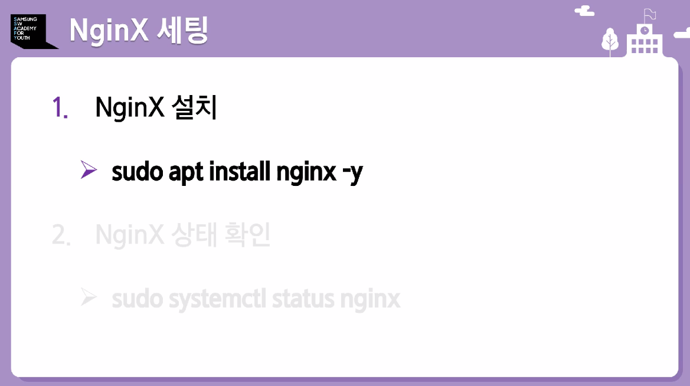
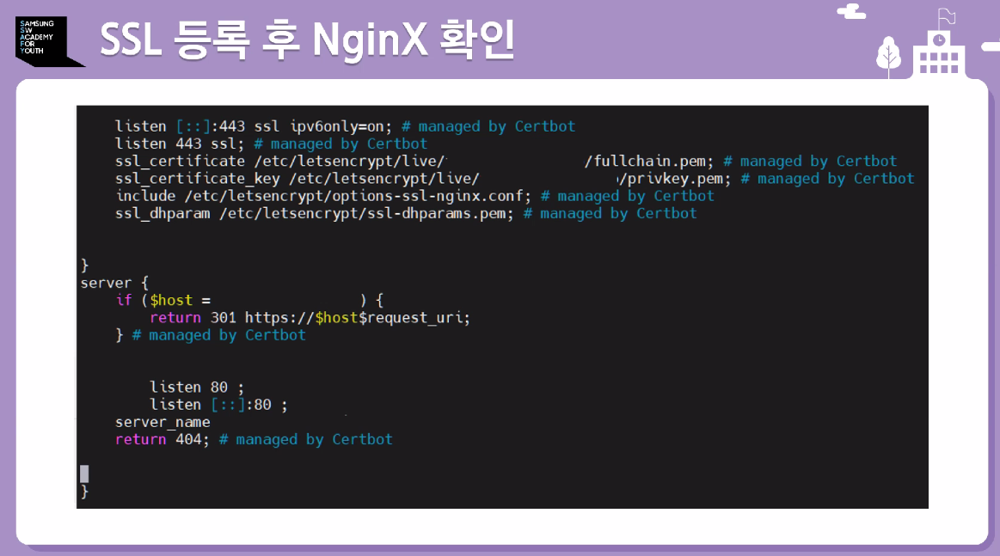

서버시간변경
sudo timedatectl set-timezone Asia/Seoul

미러 서버 변경
sudo vi /etc/apt/sources.list

:%s/kr/archive.ubuntu.com/mirror.kakao.com/

패키지 업데이트 및 업그레이드
sudo apt update

sudo add-apt-repository --remove ppa:certbot/certbot
하고 나서 엔터키

위 4개 포트는 손대질 말것. 특히 22번 포트

NginX 설치하기

SSL이 뭐냐?
보안 프로토콜

리다이렉트가 2번

이걸 하면 이렇게 보임

여기까지 하면 이제 도커 설정

도커란 무엇이냐?

설치할 때 공식문서 꼭 보면서 하기

서버 배포 흐름

도커 허브는 또 뭐냐?

도커파일 작성하기. 주로 쓰이는 명령어들

도커 이미지 만들기

npm run bulid

이미지 빌드할때 반드시 마지막에 . 을 찍어줘야한다.

여기까지 로컬에서 푸시함.
빌드를 할 서버에서 푸시하고, 배포 할 서버에서 풀 받는다.

여기서 보면docker로 시작하는데 sudo가 붙어있어야함.

여기까지 도커

젠킨스 싸피 가이드 확인하기

프리스타일 장단점

파이프라인 장단점

위에 2개가 프리스타일
아래 2개가 파이프라인

배포가 되면 주의할 점

3306 --> mysql
6379 --> REDIS
27017 --> 몽고디비

