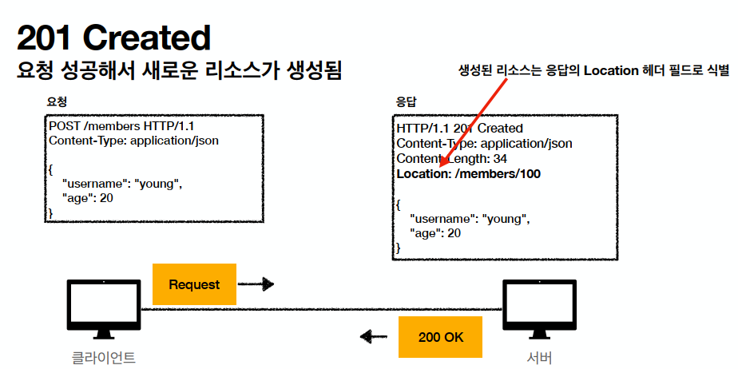
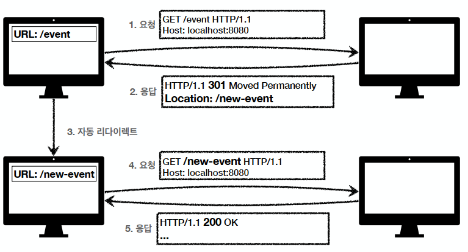

# 1. HTTP 상태코드

## 1. 상태코드

- ### 1xx Informational : 요청이 수신되어 처리중일 때 반환값으로서, 거의 사용되지 않는다.

- ### 2xx Successful: 클라이언트 요청을 성공적으로 처리 했을 때 반환되는 값이다.
  - 200 : OK
    - 요청 성공
  - 201 : Created
    - 요청에 성공해서 새로운 리소스 생성
    - 
  - 202 : Accepted
    - 요청은 접수 됐지만, 처리가 완료 되지 않았음
  - 204 : Not Content
    - 서버가 요청을 성공적으로 수행. 하지만 응답 페이지 본문에 보낼 데이터가 없음
    - 결과 내용이 없어도 204 를 띄운다면 성공으로 인식할 수 있다.

- ### 3xx Redirection : 요청을 완료하기 위해 유저 에이전트의 추가 조치 필요
  - 웹 브라우저는 3xx 응답의 결과에 Location 헤더가 있으면, Location 위치로 자동 이동 --> Redirect
    - 

  - 리다이렉션 종류
    - 영구 리다이렉션
      - 특정 리소스의 URL이 영구적으로 이동
      - 301 , 308
    - 일시 리다이렉션
      - 일시적인 변경
      - 302, 303, 307
    - 특수 리다이렉션
      - 결과 대신 캐시를 사용

  - 301 : Moved Permanently
    - 기본적으로 HTTP 메소드와 본문을 변경하지 않고 리디렉션을 수행하지만,
    - 일부 브라우저는 302 리디렉션 후에 GET 요청으로 변경될 수 있다.

  - 302 : Found
    - 기본적으로 HTTP 메소드와 본문을 변경하지 않고 리디렉션을 수행하지만,
    - 일부 브라우저는 302 리디렉션 후에 GET 요청으로 변경될 수 있다.

  - 303 : See Other
    - 302와 기능은 같지만,
    - 리다이렉트시 요청 메서드가 GET으로 변경된다.

  - 307 : Temporary Redirect
    - 302과 기능은 같지만,
    - 리다이렉트 요청 메서드가 변경되지 않고 유지된다.

  - 308 : Permanent Redirect
    - 301과 기능은 같지만,
    - 리다이렉트 요청 메서드가 변경되지 않고 유지된다.
  

- ### 4xx Client Error: 오류의 원인이 클라이언트에 있음 (웹 개발시에는 Frontend 잘못 경우가 크다.)
  - 요청 파라미터가 잘못됐거나, API 스펙이 맞지 않을때 반환된다.

  - 401 : Unauthorized
    - 클라이언트가 해당 리소스에 대한 인증이 필요
    -  WWW-Authenticate 헤더와 함께 인증 방법을 설명해야한다.
  
  - 403 : Forbidden
    - 서버가 요청에 대해 이해했지만, 승인을 거부
    - 인증 자격에 대해 증명이 됐지만, 권한이 없을 때 반환된다.

  - 404 : Not Found
    - 요청 리소스가 서버에 없을 때 반환된다.

- ### 5xx Internal Server Error: 서버 문제로 오류 발생
  - 서버에 문제가 있기 때문에 재시도 하면 성공 할 수도 있다.

  - 500 Internal Server Error
    - 서버 문제로 오류 발생

  - 502 Bad Gateway
    - 서버가 요청을 처리하는데 필요한 응답을 얻기 위해 게이트웨이로 작업하고 있고,
    - 유효하지 않은 응답을 받았을 때 발생
    - 네트워크 오류로 상위서버로부터 정상적인 응답을 못받을 때도 출력

  - 503 Service Unavailable
    - 서비스 이용 불가
    - 주로 서버 유지보수를 위해 중단하거나, 과부하 걸렸을 때 반환