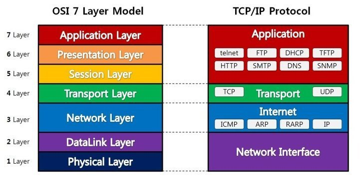
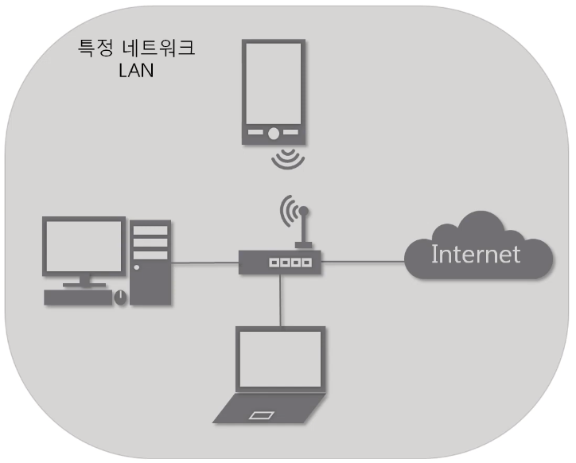
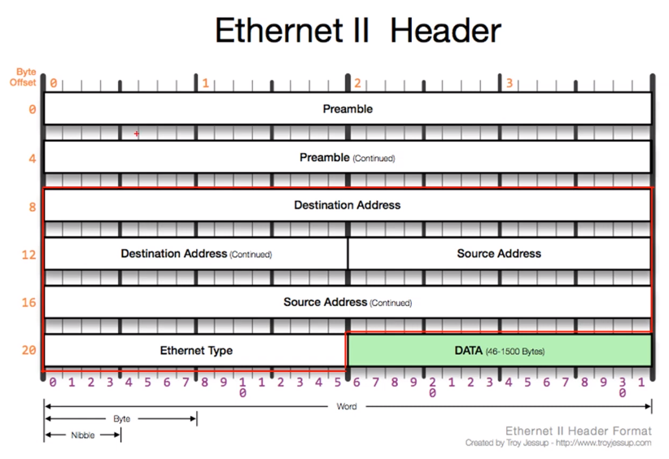

#  OSI 7 계층

## 2계층

- 데이터 링크 계층(DataLink Layer)

- 가까이 있는 컴퓨터끼리는 이런식으로 데이터를 주고 받는다.

물리 계층을 통해 송수신되는 정보의 오류와 흐름을 관리
--> 안전한 **정보의 전달을 수행**할 수 있도록 도와주는 역할

통신에서의 오류를 찾고 재전송하는 기능을 가진다.

**맥 주소를 가느고 통신**

이 계층에서 전송되는 단위를 프레임이라고 하고, 대표적인 장비로 **브리지, 스위치** 등 있다.(여기서 MAC 주소 사용)

#### -->  브릿지나 스위치를 통해 맥 주소를 가지고 물리계층에서 받은 정보 전달 

### 2계층에서 하는일

  #### - 2계층의 기능
    - 하나의 네트워크 대역, 즉 같은 네트워크 상에 존재하는 여러 장비 중에서 어떤 장비가 어떤 장비에게 보내는 데이터를 전달

    - 추가적으로 오류제어, 흐름제어 수행
 
  

    - 하나의 네트워크 대역 LAN에서만 통신할 때 사용
    
    - 다른 네트워크와 통신하려면 무조건 3계층이 도와줘야한다.

### 2계층에서 사용하는 주소

  #### - 물리적인 주소
    - MAC 주소는 물리적인 주소라고도 함.

    - 실제 물리적인 장비가 부여받은 고유한 주소 값

    - 16진수로 표현

    - 12개의 16진수로 이뤄져 있으며,
      OUI : IEEE에서 부여하는 일종의 제조회사 식별 ID
      고유번호: 제조사에서 부여한 고유번호
      로 이뤄져 있음.

### 2계층(Ethernet) 프로토콜

  #### Ethernet 프로토콜

    LAN을 위해 개발된 컴퓨터 네트워크 기술

  

    1. Destination Address (목적지 주소)
    데이터를 전달받을 상대방 시스템의  MAC 주소 할당.
    6 byte
    
    2.  Source Address (출발지 주소)
    데이터를 전달하는 시스템의  MAC 주소 할당.
     6 Byte

    3. Ethernet Type(상위 프로토콜 타입)
    상위계층의 프로토콜 종류를 표현. 2byte

https://blog.naver.com/lunarispars/221436602441

 

## 3계층

 - 네트워크 계층(Network Layer)
 - 경로를 선택하고, 주소글 정하고, 경로에 따라 패킷을 전달하는 주는 역할을 수행
 - 4계층에서 만든 segment에 IP 헤더를 붙여 packet을 만드는 단계

네트워크 계층은 여러개의 노드를 거칠 때마다 경로를 찾아주는 역할을 하는 계층으로 다양한 길이의 데이터를 네트워크를 통해 전달,
그 과정에서 전송계층이 요구하는 서비스 품질을 제공하기 위한 기능적 절차적 수단 제공

단, 데이터가 **정확하게 전달하는 것을 보장하지는 않는다.**

대표적인 장비로 **라우터(L3)** 가 있다.

라우터의 역할: 데이터를 목적지까지 가장 안전하고 빠르게 전달

라우팅 테이블에 어디로 보내야 하는지 저장되있다.

#### TCP/IP 상에서 IP 계층이란 네트워크 주소를 정의하고 IP 패킷의 전달 및 라우팅을 담당하는 계층이며, OSI 7계층 모델 관점에서 보면 네트워크계층이 해당.

### 3계층(IP) 프로토콜

 #### IPv4 프로토콜

    다른 네트워크의 특정 대상을 찾는 프로토콜
    IPv6의 경우 128bit로 된 IP/ IPv4의 경우 32bit
  
  #### ARP 프로토콜
    같은 네트워크 대역에서 통신하기 위해 필요한 MAC 주소를 IP주소를 이용해서 알아오는 프로토콜

  #### ACMP 프로토콜
    인터넷 제어 메시지 프로토콜
    네트워크 컴퓨터 위에서 돌아가는 운영체제에서 오류메시지를 전송 받는데 주로 사용

## 4계층

- 데이터 전송을 관리하는 계층
- 송신자와 수신자 간의 신뢰성 있는 데이터 전송을 보장하고, 데이터 오류 및 손실 없이 효율적으로 정보를 주고 받을 수 있도록 하는 역할 수행
- 보통 TCP 프로토콜을 이용하며, 포트를 열어서 응용 프로그램들이 전송 할 수 있게 한다
- 만약 데이터가 오면 4계층에서 헤당 데이터를 하나로 합친 뒤 5계층으로 송신
- 이 계층까지는 물리적인 계층에 속한다.

전송 계층은 양 끝 단의 사용자들이 신뢰성 있는데이터를 주고 받을 수 있도록 해주고, 상위 계층들이 데이터 전달이나 유효성, 효율성을 생각하지 않도록 해준다.

시퀀스 넘버 기반의 오류 제어 방식을 사용한다

전송계층은 특정 연결의 유효성을 제어하고 일부 프로토콜은 상태개념이 있고 연결 기반이다. 이는 전송 계층이 패킷들의 전송이 유효한지 확인하고 전송 실패한 패킷들을 다시 전송한다는 뜻이다.

오류 검출 및 복구, 흐름제어, 세그먼트화 및 재조립, 연결 지향 및 비연결 지향 서비스 제공을 한다.

전송계층은 주로 소프트웨어 레벨에서 작동하기 때문에 하드웨어가 아닌 소프트웨어 구성요소가 중요하며, TCP/IP 스택이나 다른 네트워크 프로토콜 구현이 이에 해당한다.

전송계층에서는 일반적으로 포트번호를 사용하며, 이 포트번호는 특정 네트워크 서비스나 어플리케이션을 식별하는데 사용된다.

### 4계층 프로토콜

#### TCP 프로토콜
- Transmission Control Protocol
- 연결 지향적이며, 데이터의 신뢰성 있는 전송을 보장

#### UDP 프로토콜
- User Datagram Protocol
- 비연결 지향적이며, 빠르지만 신뢰성이 떨어질 수 있는 전송을 제공
- 가상회선을 굳이 확립할 필요가 없고 유연하며 효율적 응용의 데이타 전송에 사용

https://www.youtube.com/watch?v=_i8O_o2ozlE&list=PL0d8NnikouEWcF1jJueLdjRIC4HsUlULi&index=9