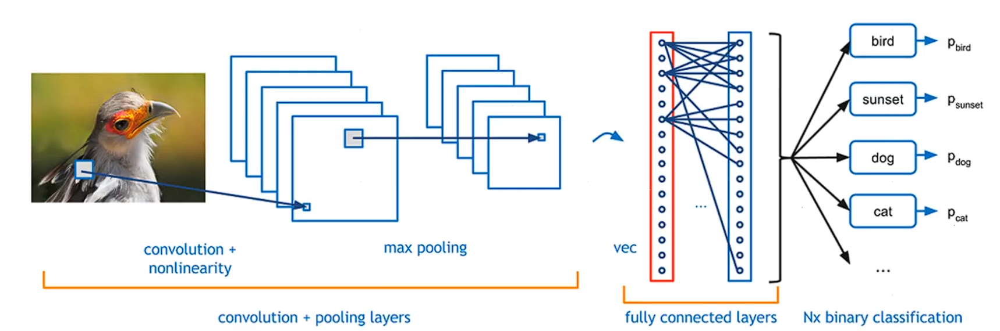

## 인공지능, 머신러닝, 딥러닝

- **인공지능**을 간단하게 정의하면 **사람처럼 행동하도록 만들어진 장치** 라고 할 수 있다.
- **머신러닝**은 **다량의 데이터 학습을 통해 얻어진 러닝 함수를 찾고 이를 기반하여 자동으로 답을 찾아주는 것**
- **딥러닝**은 **머신러닝에 인간의 논리 구조인 인공 신경망을 더한 기술**이다.

#### 딥러닝 모델 종류

#### 1. CNN - Convolutional Neural Network, 합성곱 신경망

데이터의 특징을 추출하여 특징들의 패턴을 파악하는 구조. Convolution 과정과 Pooling 과정을 통해 복합적으로 Layer를 구성하여 알고리즘을 생성

- Convolution
  - 데이터의 특징을 추출하는 과정으로 데이터에 각 성분의 인접 성분들을 조사해 특징을 파악하고 파악한 특징을 한장으로 도출시키는 과정이다. 여기서 도출된 장을 Convolution Layer라고 한다. 이 과정은 하나의 압축 과정으로 볼 수 있으며, 파라미터의 갯수를 효과적으로 줄여주는 역할을 수행.
- pooling
  - Convolution 과정을 거친 레이어의 사이즈를 줄여주는 과정입니다. 이는 데이터의 사이즈를 단순히 줄여주는 것뿐만 아니라, 노이즈를 상쇄시키고 미세한 부분에서 일관적인 특징을 제공.

 

- 노드 간 연결 갯수가 기하급수적으로 증가하여 크기가 작은 필터(filter)를 사용함
- 이로 인해 가중치의 개수를 줄어주며 국부 영역에 대한 특징에 집중할 수 있는 특성이 있음
- 위의 특징으로 학습이 가능해 비전(vision) 분야에서 성능이 우수함
- 이미지를 인식하기 위해 패턴을 찾는데 특히 유용함
- 데이터를 직접 학습하고 패턴을 사용해 이미지를 분류함
- 자율주행자동차, 얼굴인식과 같은 객체인식이나 computer vision이 필요한 분야에 많이 사용되고 있음
- 이미지의 공간 정보를 유지한 채 학습을 하게 하는 모델 (1D로 변환하는 것이 아닌 2D 그대로 작업함)
- 사람이 여러 데이터를 보고 기억한 후에 무엇인 지 맞추는 것과 유사함

#### 2. RNN - Recurrent Neural Network, 순환 신경망

- 알고리즘은 반복적이고 순차적인 데이터(Sequential data) 학습에 특화된 인공신경망의 한 종류입니다. 내부의 순환구조가 있어 과거의 학습을 가중치를 통해 현재 학습에 반영한다. 기존의 지속적이고 반복적이며 순차적인 데이터 학습의 한계를 해결한 알고리즘이다.
- 가변성과 선후 관계로 동작하는 어플리케이션을 위한 러닝 모델
- 텍스트, 음성, 음악, 영상 등 순차적 데이터를 다루는데 적합함
- 베니싱 그레디언트 문제가 있어 패턴 학습을 못하는 경우가 있음
  - 베니싱 그레디언트란?
    - 은닉층이 많은 다층 퍼셉트론에서, 은닉층을 많이 거칠수록 전달되는 오차가 크게 줄어들어 학습이 되지 않는 현상
    - 이를 개선하기 위해 LSTM(Long Short Term Memory, 단기 메모리 네트워크)가 개발
- LSTM으로 RNN문제가 어느정도 해결되어 자동 작곡, 작사, 저술, 주가 예측 등 다양한 분야에 적용되고 있음
- 마치 우리가 적성검사의 추론 영역을 푸는 것과 유사 (과거 데이터를 통해 다음을 추론)

#### 3. GAN - Generative Adversarial Network, 생성 대립 신경망

- 비지도 학습으로 학습된 패턴을 이용해 이미지나 음성을 생성
- Source A 와 Source B를 합성하여 가짜를 생성함
- 이미지 및 음성 복원에 사용
- 딥페이크에 많이 사용되고 있음
- DCGAN(Deep Convolution GAN)은 불안정한 GAN 구조를 개선해 새로운 의미를 가진 이미지를 생성

#### 딥러닝 툴 종류

1. Torch
   - Lua 프로그래밍 언어를 기반으로 한 딥러닝 라이브러리로, 신경망을 설계하고 학습시키는 데 사용
2. Pytorch
   - Torch의 파이썬 버전으로, 유연성과 속도를 제공하는 오픈소스 머신러닝 라이브러리
3. Neural Designer
   - 고급 분석을 위한 그래픽 사용자 인터페이스를 제공하는 상업용 머신러닝 소프트웨어
4. Tensor Flow
   - 구글이 개발한 오픈소스 머신러닝 프레임워크로, 데이터 플로우 그래프를 사용하여 복잡한 수치 연산을 수행합니다. 다양한 플랫폼과 장치에서 실행될 수 있으며, 딥러닝과 머신러닝 연구 및 개발에 널리 사용
5. Jupyter Notebook
   - Python 프로그래밍 언어로 작성된 무료 소프트웨어 머신러닝 라이브러리입니다. 분류, 회귀, 클러스터링 등 다양한 머신러닝 알고리즘 제공
6. Scikit-learn
   - Python 프로그래밍 언어로 작성된 무료 소프트웨어 머신러닝 라이브러리입니다. 분류, 회귀, 클러스터링 등 다양한 머신러닝 알고리즘 제공
7. Keras
   - Python을 사용하여 신경망을 쉽게 구현할 수 있도록 도와주는 고수준 신경망 API입니다. TensorFlow, Theano, Microsoft Cognitive Toolkit 등의 백엔드 지원
