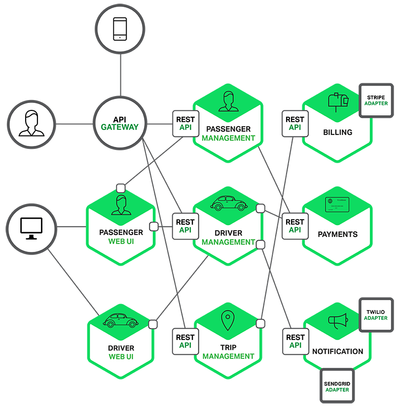

# MSA(Micro Services Architecture)란 무엇인가?

#### AWS에서 내린 정의 :소프트웨어가 잘 정의된 API를 통해 통신하는 소규모의 독립적인 서비스로 구성되어 있는 경우의 소프트웨어 개발을 위한 아키텍처 및 조직적 접근 방식
  - 핵심은 **API를 통해 통신하는 소규모 독립적인 서비스**
  - 거대한 서비스를 독립적인 서비스 단위로 나누고 각각 서비스가 서로 상호작용하여 거대한 서비를 이루는 것

- 대용량 트래픽에 대응하기 위한 필요조건
- 상황에 따라서는 Monolithic가 적합한 경우도 많음
  
## **Monolithic Architecture**
  

  - 일반적으로 개발하는 방법론
  - 빠르고 쉽게 서비스를 구성할 수 있어 적은 비용으로 서비스 출시 가능

### Monolithic Architecture 단점
  - 부분 장애가 전체 서비스 장애로 확대 될 수 있다.
    - 잘못된 코드 배포, 급작스런 트래픽 증가가 생겼을 때 서비스 전체에 장애가 될 수 있다.
    - 서비스 하나에서 메모리 누수가 발생시 전체적인 성능저하로 연결
  - 서비스 변경이 어렵고 수정시 장애의 영향 파악이 어렵다.
    - 여러 컴포넌트가 하나의 서비스에 결합되어 있어 사이드 이펙트가 서비스 전반에 발생할 수 있다.
  - 시스템 요구사항이 많이질수록 점점 더 개발 생산성이 낮아진다.
    - 규모가 커질수록 약간의 코드 수정후 배포할 때도 전체 서비스를 다시 빌드하고 배포해야한다.
    - 개발자가 모든 피처를 파악하기 점점 더 어려워지면서 새로운 기능 추가나 변경이 어려워진다.

#### 하지만 Monolithic를 먼저 구축하고 필요시 MSA로 전환하는 것이 좋다.

## **Micro Services Architecture**

### MSA 장점
- 독립적으로 배포가 가능
- 스스로 돌아갈 수 있는 작은 서비스
- 특정 서비스에 대한 확장 용이(Scale Out)
- 장애가 전체 서비스로 확장되는 가능성이 적음
- 서비스를 팀 단위로 운영 가능
- 각각의 서비스를 서로 다른 언어, 다른 DB 기술을 사용 할 수 있다.

### MSA 단점
- 테스트와 트랜잭션 다루기 어려움
- 컴퓨팅 자원 사용이 비효율적
- 내부 호출이 아닌 API간 통신으로서 성능이 느리다

https://tech.kakao.com/2021/09/14/msa/