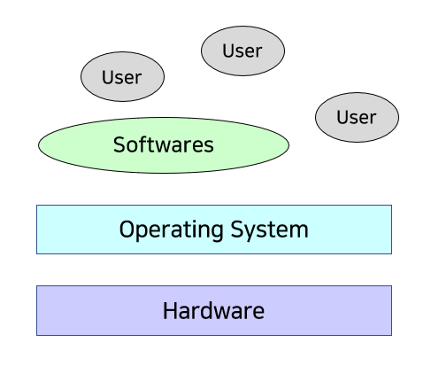
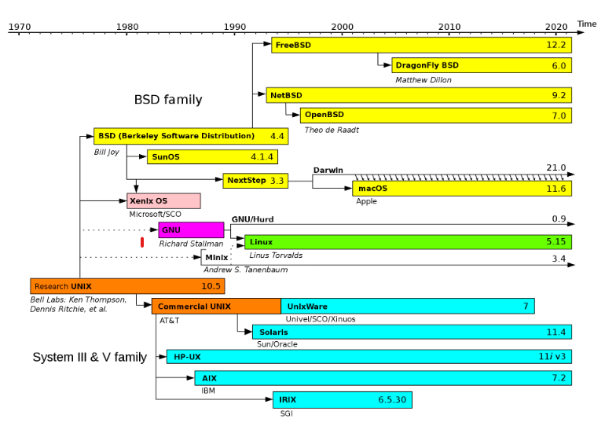
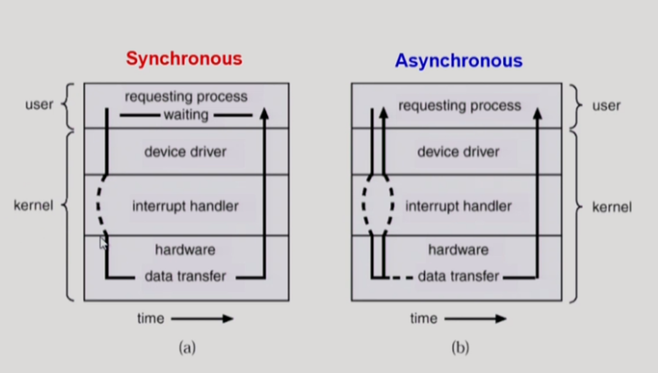
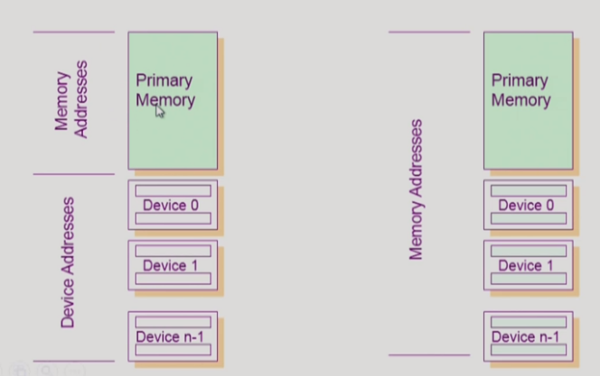
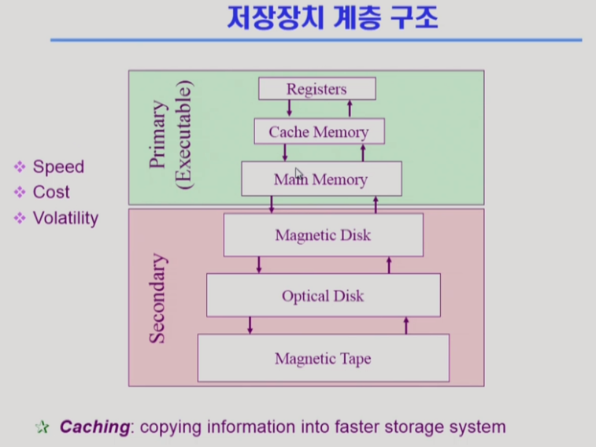
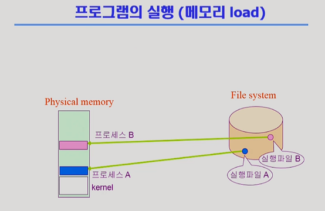
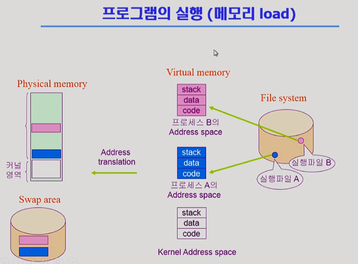
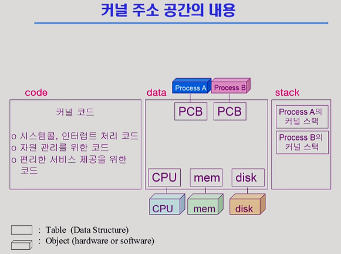
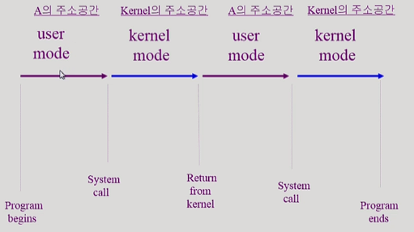

영상: [운영체제](http://www.kocw.net/home/search/kemView.do?kemId=1046323)

## [1 운영체제 개요](https://core.ewha.ac.kr/publicview/C0101020140307151724641842?vmode=f)

### A. 운영 체제란?

- 컴퓨터 하드웨어 바로 위에 설치되어 사용자 및 다른 모든 소프트웨어와 하드웨어를 연결하는 소프트웨어 계층

#### 좁은 의미의 운영체제

- 커널
- 운영체제의 핵심 부분으로 메모리에 상주하는 부분 시스템의 모든것을 제어.
- 하드웨어 자원을 자원이 필요한 프로세스에 나눠주고, 프로세스 제어, 메모리 제어, 프로그램이 운영체제에 요구하는 시스템 콜 등을 수행하는 부분으로 운영체제 맨 하부에서 돌아간다.

#### 넓은 의미의 운영체제

- 커널 뿐 아니라 각종 주변 시스템 유틸리티를 포함한 개념

### B. 운영 체체의 목적

- 컴퓨터 시스템의 자원을 효율적으로 관리
  - 프로세서, 기억장치, 입출력 장치 등을 자원 또는 리소스라고 함.
- 사용자에게 컴퓨터 시스템을 편리하게 사용할 수 있는 환경을 제공

### C. 운영 체제의 분류

#### 1. 동시 작업 가능 여부

- 단일 작업

  - 한 번에 하나의 작업만 처리
  - 한 명령의 수행을 끝내기 전에 다른 명령 수행시킬 수 없음(MS-DOS)

- 다중 작업
  - 동시에 두개 이상의 작업 처리
  - 한 명령의 수행이 끝나기 전에 다른 명령이나 프로그램을 수행 할 수 있음

#### 2. 사용자 수

- 단일 사용자

- 다중 사용자

#### 3. 처리방식

- 일괄처리 (Batch Processing)

  - 작업 요청의 일정량 모아서 한꺼번에 처리
  - 작업이 완전 종료될 때까지 출력값이 없음.

- 시분할(Time Sharing)

  - 요즘 사용하고 있는 컴퓨터 그 자체
  - 여러 작업을 수행 할 때 컴퓨터 처리 능력을 일정한 시간 단위로 분할하여 사용
  - 짧은 응답시간을 가진다.
  - 종료 시간이 보장되지 않음

- 실시간(Realtime OS)
  - 정해진 시간안에 어떠한 일이 반드시 종료됨이 보장 되어야 하는 실시간 시스템을 위한 OS
  - 원자로, 미사일 제어, 반도체 장비, 로보트 제어

### 몇 가지 용어

- Multi-tacking
  - 여러 작업이 동시에 작업되는 걸 보통 이렇게 말함.
  - cpu에서는 짧은 시간 분할해서 동시에 실행되는 것 처럼 보임
- Multi-programming
  - 메모리에 여러 프로그램이 올라가 있음을 강조할 때 이 용어를 사용
- Time sharing
  - 시간을 분할해서 나누어 쓴다는 것을 강조할 때 사용
- Multi-processor
  - 하나의 컴퓨터에 CPU가 여러개 붙어 있음을 의미

### 운영 체제의 예

#### 1. UNIX

- 대형 컴퓨터를 위해 만들어진 운영체제
- 코드 대부분을 C언어로 작성
- 높은 이식성
- 최소한의 커널 구조
- 프로그램 개발에 용이
- 다양한 버전 - System V, FreeBSD, SunOS, Solaris - Linux (UNIX에서 파생된 운영체제. UNIX 기반 운영체제는 아니다.)
  

#### 2. MS DOS

- 단일 사용자용 운영체제
- IBM-PC를 위해 개발
- 메모리 관리 능력의 한계

#### 3. MS Windows

- 다중 작업용 GUI 기반 운영체제
- Plug and Play
- 네트워크 환경 강화
- DOS용 응용 프로그램과 호환성 제공
- 불안정성
- 풍부한 지원 소프트웨어

## [2 시스템 구조 및 프로그램의 실행 Part-1](https://core.ewha.ac.kr/publicview/C0101020140311132925816476?vmode=f)

### 컴퓨터 시스템 구조

- CPU는 작업공간으로 메모리를 가지고, I/O 디바이스는 각각 고유의 디바이스 컨트롤러(cpu)를 가지며 각각의 작업공간인 로컬 버퍼(메모리)를 가진다.

### Mode bit

- CPU에서 실행되는 것이 운영체제인지, 사용자 프로그램인지 구분하는 역할을 수행
- 사용자 프로그램의 잘못된 수행으로 다른 프로그램 및 운영체제에 피해가 가지 않도록 하기 위한 보호장치
- 1 일때, 사용자모드: 사용자 프로그램 수행
- 0 일때, OS코드 수행

### Interrupt line

- CPU는 항상 메모리에 있는 instructions만 받아서 계속 실행하는데, 디스크, 키보드 이런거에 입력이나 뭐 이런 통신을 할 때 사용된다.

### Timer

- 특정 프로그램이 CPU 독점을 막기위해 존재
- 여러 사용자 프로그램이 실행이 되면 타이머에 값을 세팅한 다음에 CPU 할당
- 그러면 사용자 프로그램은 독점적으로 사용 못하게한다.
- 타이머는 Time Sharing을 구현하기 위해 널리 이용된다.
- 현재 시간을 계산하기 위해서도 사용

### Device Controller

- 컴퓨터와 연결된 I/O Device가 가지는 고유 CPU
- 제어 정보를 위해 control resister, status resister를 가진다.
- local buffer(일종의 data resister) 를 가진다
- I/O가 끝났을 경우 interrupt로 CPU에서 그 사실을 전달

#### Devide driver(장치구동기)

- OS 코드 중 각 장치별 처리하기위해서 인터페이스가 있는데 이거에 맞게 접근할 수 있게 해주는 역할 --> software

### [입출력과 인터럽트 (Input-Output and Interrupt)](/컴퓨터-구조/5장-기본-컴퓨터의-구조와-설계-Part2/입출력과-인터럽트.md)

### 시스템 콜 (System Call)

- 사용자 프로그램이 운영체제의 서비스를 받기 위해 커널 함수를 호출하는 것

## [2 시스템 구조 및 프로그램의 실행 Part-2](https://core.ewha.ac.kr/publicview/C0101020140314151238067290?vmode=f)

### 동기식 입출력과 비동기식 입출력

- 동기실 입출력
  I/O 요청 후 입출력 작업이 완료된 후에야 제어가 사용자 프로그램에 넘어감

  - 구현방법1

    - I/O가 끝날 때까지 CPU를 낭비시킴
    - 매시점 하나의 I/O만 일어날 수 있음

  - 구현방법2
    - I/O가 완료될 때까지 해당 프로그램에게서 CPU를 빼앗음
    - I/O 처리를 기다리는 줄에 그 프로그램을 줄 세움
    - 다른 프로그램에게 CPU를 줌

- 비동기식 입출력
  - I/O가 시작된 후 입출력 작업이 끝나기를 기다리지 않고 제어가 사용자 프로그램에 즉시 넘어감

--> 두 경우 모두 I/O의 완료를 인터럽트로 알려준다.

### DMA (Direct Memory Access)

- 메모리에 접근할 수 있는건 CPU.
- 하지만, DMA cotroler를 두면 CPU, DMA도 접근할 수 있게 된다.
- 이때, CPU와 DMA가 동시에 메모리의 같은 주소값에 접근할 경우 이를 중재하기 위해 메모리는 memory controller를 가진다.
- I/O 디바이스에서 Local buffer로 들어오는 내용들을 DMA가 직접 메모리로 복사해오는 역할을 수행하고, 이 작업이 끝나면 CPU에 interrupt를 1번만 걸어서 작업이 끝났다는것을 알림
-

### 서로 다른 입출력 명령어

- I/O를 할 수 있는 2가지 방식이 존재
  - I/O를 수행하기 위해 메모리만 접근하는 instructions이, I/O에 접근하는 special instructions이 따로 있음
  - I/O에 메모리 주소를 할당하여 메모리 접근하는 instructions을 통해서 I/O에 접근할수도 있음 (memory Mapped)

### 저장장치 계층 구조

- cpu가 직접 접근할 수 있는 스토리지 --> Primary

  - byte 단위로 접근이 가능해야한다.
  - 하드디스크같은 Secindary는 sector 단위로 접근

- Caching: 재사용성이 주 목적

- [12장 메모리 구조](/컴퓨터-구조/12장-메모리-구조.md)

### 프로그램의 실행 (메모리 load)

- 실행파일 형태로 디스크에 저장되어있음
  - 이를 실행하면 메모리에 할당되어 프로세스가 된다.

- 실제로는 위와같이 물리메모리에 발로 올라가지 않고 중간에 가상메모리 단계를 거친다.
- 어떤 프로그램을 실행시키면 해당 프로그램의 주소공간이 형성됨
  - code : cpu에 실행할 기계어 코드
  - data : 전역변수 같은 프로그램이 사용하는 자료구조를 담고있음
  - stack : 함수를 호출하거나 리턴할 때 데이터를 쌓았다가 꺼내갈 때 사용됨
- 커널은 컴퓨터를 켜서 부팅하면 메모리에 항상 상주해 있음
- 가상메모리에 있는 주소공간 전체를 물리메모리에 올리지 않음
  - 당장 필요한 code 부분만 올려놓는다.
  - 그렇지 않은것은 디스크의 swap area에 내려놓는다
- 띠라서 한 프로그램의 프로세스라도 필요에 따라 물리메모리, swap area에 나눠서 공간을 차지한다.
- swap area는 메모리 용량 한계로 연장공간으로 사용됨. 따라서 휘발성

### 커널 주소 공간의 내용

- PCB: Process control block

### 사용자 프로그램이 사용하는 함수

- 모든 프로그램은 함수형태로 작성되어있음

- 사용자 정의 함수
  - 자신의 프로그램에서 정의한 함수
- 라이브러리 함수
  - 프로그램 내에서 정의하지 않고 가져다 쓴 함수
  - 프로그램 실행 파일에 포함되어 있음
- 커널 함수
  - 운영체제 프로그램의 함수
  - 커널 함수의 호출 = 시스템 콜

### 프로그램 실행 life cycle

- 프로그램은 유저모드와 커널모드를 반복하여 실행된다.