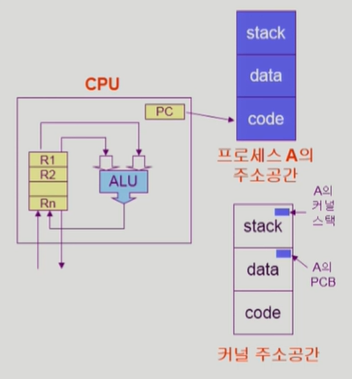

## [프로세스 #1](https://core.ewha.ac.kr/publicview/C0101020140318134023355997?vmode=f)

### 프로세스의 개념

- 프로세스란 실행중인 프로그램
- Proces is a program in execution

- 프로세스의 문맥
- CPU 수행 상태를 나타내는 하드웨어 문맥
- Program Counter, 각종 레지스터
- 프로세스의 주소 공간 (code, data, stack)
- 프로세스 관련 커널 자료구조
  - PCB (Process Control Block)
  - kernel stack

### 프로세스의  상태 (Process State)

- 프로세스는 상태가 변경되면서 수행된다.
-
  - ready: 프로세스가 CPU를 기다리는 상태(메모리 등 다른 조건을 모두 만족하고)
  - running: 프로세스가 CPU를 차지하여 instruction을 수행중인 상태
  - Blocked(wait, sleep)
    - CPU를 주어도 당장 instruction을 수행 할 수 없는 단계
    - Process 자신이 요청한 이벤트가 즉시 만족되지 않아 이를 기다리는 상태
    - ex) 디스크에서 file을 읽어와야하는 경우
  - new: 프로세스가 생성중인 상태
  - terminated: 프로세스의 실행이 종료된 상태

 

- Suspended (stopped)
  - 외부적인 이유로 프로세스의 수행이 정지된 상태
  - 프로세스는 통째로 디스크에 swap out 된다
  - 예시
    - 사용자가 프로그램을 일시 정지시킨 경우
    - 시스템이 여러 이유로 프로세스를 잠시 중단시킴
    - 메모리에 너무 많은 프로세스가 올라와 있을 경우
  
   
   
  - Blocked : 자신이 요청한 event가 만족되면 Ready
  - Suspended: 외부에서 정지시켜놓았으며 외부에서 resume해 주어야 Active

  - 프로세스 상태도

    
  - 

### Process Control Block(PCB)

- 운영체제가 각 프로세스를 관리하기 위해 프로세스당 유지하는 정보
- 구조체로 아래와 같은 구성 요소를 가진다.
  1. OS가 관리상 사용하는 정보: Process state, process ID, scheduling information, priority
  2. CPU 수행 관련 하드웨어 값(프로세스 문맥을 표시하기 위한 정보): Program counter, resisters
  3. 메모리 관련: Code, data, stack 위치정보
  4. 파일 관련: Open file descriptors...
  
  

### 문맥 교환 (Context Switch)

- CPU가 한 프로세스에서 다른 프로세스로 넘겨주는 과정
- CPU가 다른 프로세스에게 넘어갈 때 운영체제는 아래 과정을 수행
  - CPU를 내어주는 프로세스의 상태를 그 프로세스의 PCB에 저장
  - CPU를 새롭게 얻는 프로세스의 상태를 PCB에서 읽어옴
  
  

- 문맥교환은 System call이나 Intereupt 발생시 반드시 문맥교환이 일어나는 것은 아님
  - System call은 프로세스가 본인이 필요해서 운영체제에 뭔가를 요청할때
  - herdware Intereupt는 컨트롤러같은 장치가 CPU한테 정보를 전달할 목적으로 발생
  - 이 2개는 CPU 제어권이 사용자 프로세스로부터 운영체저 커널에 넘어가는데 이걸 문맥교환(Context Switch)이라고 부르는것은 아님
  - 문맥교환은 하나의 사용자 프로세스로부터 또다른 사용자 프로세스로 넘어가는 과정
  - 이와 비교해서 System call이나 herdware Intereupt는 CPU 제어권이 사용자 프로세스로부터 운영체제로 넘어감
  
  
  
  - 1번 사례의 경우와는 프로세스가 바뀌지 않았지만, 2번사례의 경우 프로세스가 바뀌었으므로 문맥교환이 일어남
  - 이떄, 1번의 경우에도 CPU 수행 정보 등 context의 일부를 PCB에 save 해야하지만, 문맥교환의 경우 그 부당이 훨씬 크다.(eg. cache memory flush)
  - 보통 프로세스가 1에서 2로 넘어가는 경우 캐시메모리를 다 지우고 주메모리로 이동시킴(cache memory flush)
  -

### 프로세스를 스케줄링하기 위한 큐

- job queue
  - 현재 시스템 내에 있는 모든 프로세스의 집합
  - Ready나 Device queue에 들어있는 것들이 이 안에 들어있음
- Ready queue
  - CPU를 기다리는 줄. 현재 메모리 내에 있으면서 CPU를 잡아서 실행되기를 기다리는 프로세스의 집합
- Device queues
  - I/O device의 처리를 기다리는 프로세스의 집합
- 프로세스들은 각 큐를 오가며 수행

### 스케줄러 (Scheduler)

- Long-term scheduler(장기 스케줄러, job scheduler)
  - **메모리에 어떤 프로세스를 줄지 결정**
- 시작 프로세스 중 어떤 것들을 **ready queue**에 보낼지를 결정
  - **degree Multi programming**을 제어(메모리에 프로그램이 몇 개 올라가있는지 그 수를 나타냄)
  - time sharing system에는 보통 장기 스케줄러가 없고 ready로 감
    - 즉 우리가 보통 사용하는 시스템에서는 장기 스케줄러가 없음
    -
-
- short-term scheduler(단기 스케줄러, CPU scheduler)
  - **프로세스에 CPU를 주는 문제**
  - CPU에 어떤 프로세스를 **running** 시킬지 결정**-
  - 짧은 시간 단위로 이뤄지며 보통 ms 단위로 이뤄짐

- Medium-term scheduler(중기 스케줄러, Swapper)
  - 여유공간 마련을 위해 프로세스를 통쨰로 메모리에서 디스크로 쫒아냄
  - 프로세스에서 메모리를 뻇는 문제
  - **degree Multi programming**을 제어
  - 지금의 시스템에서는 일단 메모리에 다 올려놓고, 메모리에 너무 많이 올라가있으면 중기 스케줄러가 몇개를 쫒아내서 조절함

## [프로세스 #2](https://core.ewha.ac.kr/publicview/C0101020140321141759959993?vmode=f)

### Thread(lightweight process)

- 프로세스 내부에 CPU 수행 단위가 여러개 있는 경우를 말함

프로세스가 하나 주어지면 코드, 데이터, 스택으로 구성된 주소공간이 프로세스마다 만들어짐 \
\
프로세스 하나를 관리하기 위해서 운영체제 내부에서 PCB를 두어서 상태와 아이디, 메모리의 어느부분을 실행하고 있는지를 가리키는 program counter 등이 있다.

\
프로세스마다 별도의 주소공간을 만들면 메모리가 낭비된다. 같은 일을 하는 프로세스를 여러개 띄우면 메모리 공간은 하나만 띄워놓고 프로세스마다 다른 부분의 코드를 실행하게 해줄 수 있는데, 이게 스레드의 개념

####  즉, 스레드란 CPU를 수행하는 단위

- 스레드 구성
  - Program counter
  - resister set
  - stack space

- 프로세스 내부에서 스레드간 공유하는 부분(task)
  - code section
  - data section
  - OS resources

- 전통적인 개념의 heavyweight process는 하나의 스레드를 가지고 있는 task로 볼 수 있다.

#### 스레드의 장점

- 다중 스레드로 구성된 태스크 구조에서 하나의 서버 스레드가 waiting 상태인 동안에도 동일한 태스크 내의 다른 스레드가 실행되어 빠른 처리를 할 수 있다.
  (웹 페이지를 읽어오는 동안 브라우저는 waiting상태인데 여러개 스레드를 사용하고 있으면 이미 읽어온 태스크를 화면에 보여줄 수 있다.)

- 동일한 일을 수행하는 다중 스레드가 협력하여 높은 처리율(throughput)과 성능 향상을 얻을 수 있다.

- 스레드를 사용하면 병렬성을 높일 수 있다.

## 프로세스 #3

### Single and Multithreaded Processes

-

### Benefits of Threads

-

### Implementation of Threads

-