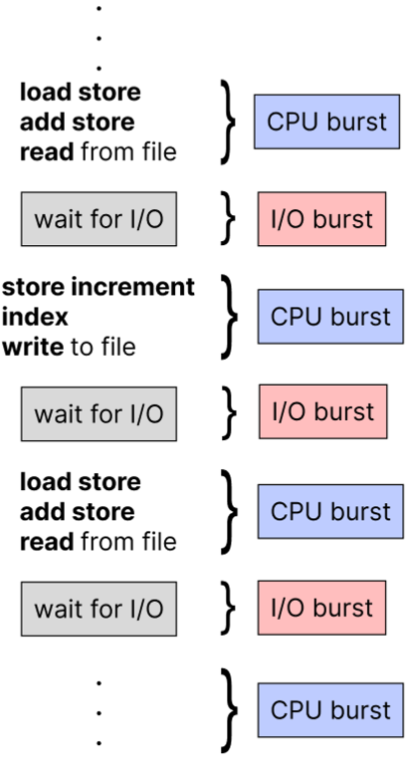
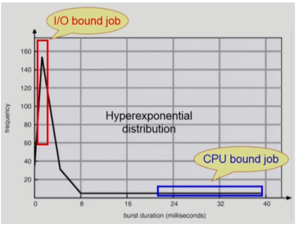

## [CPU 스케쥴링 #1](https://core.ewha.ac.kr/publicview/C0101020140328151311578473?vmode=f)

## **CPU and I/O Bursts in Program Execution**

- 프로그램 실행 시 CPU 및 I/O Bursts의 흐름을 아래와 같다.

- load store, add store 이런거는 system의 instraction을 실행하는 기계어
- CPU burst는 CPU만 연속적으로 사용하는 단계
- I/O burst는 I/O가 실행되는 단계

## **CPU-burst Time의 분포**

- 위 그래프는 컴퓨터에서 돌아가는 프로그램들의 CPU burst 타임을 그래프로 plotting
- 위 그래프를 해석하자면 CPU burst가 짧은(중간에 I/O burst가 많은 경우) 경우가 많다.
- I/O 작업 없이 CPU burst만 계속 있는 경우는 매우 적다.
- CPU를 짧게 쓰고 I/O가 중간에 끼어드는 작업을 I/O bound job이라고 한다.
- CPU를 굉장히 오래 쓰는 작업을 CPU bound job이라고 한다.

<aside>
💡 —> 그래서 여러 종류의 job(~process)가 섞여있기 때문에 CPU 스케줄링이 필요하다.

</aside>

 

<aside>
💡 그럼 위 그래프를 통해 무엇을 추론 할 수 있을까?

</aside>

- 대부분의 CPU 사용 시간은 I/O bound job이 다 쓴다.
    - 사실 그건 아니다.
    - I/O Bound job은 그저 중간 중간 자주 등장 하다 보니 CPU 사용 시간을 짧게 난도질 해서 빈도수가 높은 것임.
        - 그저 짧게 쓰는데 빈도수가 잦은 것 뿐이다.
    - CPU bound job은 CPU를 오래 써서 빈도수가 적은 것임.
        - CPU는 CPU bound job이 많이 쓴다.
    
- Interactive job에게 적절한 response를 제공 해야 한다.
    - 왜?? 사람이 답답해하니깐.
- CPU와 I/O장치 등 시스템 자원을 골고루 효율적으로 사용해야 한다.

## **프로세스의 특성 분류**

- 프로세스는 그 특성에 따라 2가지로 나눌 수 있다.
    1. **`I/O-bound process`**
        - CPU를 잡고 계산하는 시간보다 I/O에 많은 시간이 필요한 job
        - many short CPU bursts(빈번하지만, 짧다)
    2. **`CPU-bound process`**
        - 계산 위주의 job
        - few very long CPU bursts(적지만, 매우 길다)

## **CPU Scheduler & Dispatcher**

- 위와 같은 이유로 스케줄링이 필요하다.
    
    ### 1. CPU Scheduler
    
    - Ready 상태의 프로세스 중에서 어떤 프로세스에게 CPU를 할당해줄지 고르는 역할을 수행
    
    ### 2. Dispatcher
    
    - CPU 제어권을 CPU Scheduler에 의해 선택된 프로세스에 CPU를 넘겨주는 역할을 수행한다
    - 이 과정을 문맥교환(Context Swiching) 이라고 한다.
    - 그렇다면 **CPU Scheduler, Dispatcher**는 하드웨어일까 하나의 독립적인 소프트웨어 프로그램일까?
        - 정답은 하드웨어, 소프트웨어 프로그램처럼 독립적인 뭔가가 아닌, 운영체제 안에 CPU Scheduling, Dispatching 하는 코드가 있는데 이걸 그냥 **CPU Scheduler, Dispatcher** 라고 부른다.
    

<aside>
💡 그렇다면 이러한 스케줄링은 언제 필요한 걸까?

</aside>

- 프로세스에 상태변화가 있는 경우에 스케줄링이 필요하다.
ex)
    1. Running —> Blocked (I/O를 요청하는 System Call)
    2. Running —> Ready (할당시간 만료로 timer interrupt)
    3. Blocked —> Ready (I/O 완료 후 interrupt)
    4. Terminated

- 1, 4의 경우에는 스케줄러가 강제로 뺏지않고 자진반납하는 경우이며,
**`nonpreemptive`**

2, 3의 경우에는 스케줄러가 강제로 뺏거나 주는 경우에 해당한다.
**`preemptive`**

### 스케쥴링 성능 척도

- 이용률
- 처리량
- 소요 시간
- 대기 시간
- 응답 시간

## [CPU 스케쥴링 #2](https://core.ewha.ac.kr/publicview/C0101020140401134252676046?vmode=f)

### 스케쥴링 알고리즘 (복수개)

-

### 스케쥴링 알고리즘 평가 

-