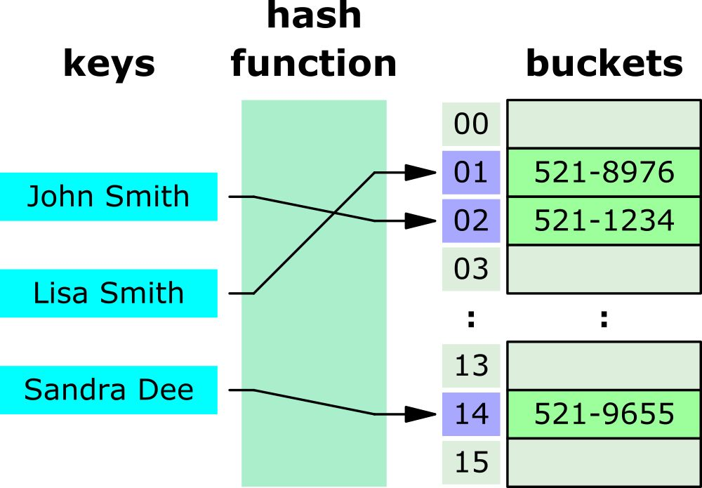

영상: https://www.youtube.com/playlist?list=PLD8rdlfZeJk6evHY9NsnBqXKrreNbTqFv

### 알고리즘
-

### 오일러 순환과 해밀턴 순환
-

### 기본 용어
-

### 그래프 채색
-

### 최소신장 트리
-

### 최단경로 알고리즘
-

## 해시 테이블
**Key에 Data를 저장하는 자료구조**

|장점|단점|
|:----|:----|
|1. 작은 리소스로 많은 데이터를 효율적으로 관리| 1. 최대 키 값을 알고 있어야한다.  | 
|2. 빠른 검색 속도|2. 최대 키 값이 작을 때 실용적이다.  |
|3. O(1) 의 시간복잡도를 가진다.|3.키 값이 고루 분포되있지 않으면 메모리 낭비가 크다.  |

<br>



##### 컴퓨터 언어 별 해시테이블 구현체

> # 1. Python
> ### 'dict' type
> - 평균 시간복잡도 O(1)
> - 최악 시간복잡도 O(n)
> - 정렬된 순서가 필요할 경우 'collections.OrderedDict' 를 사용
> - 'collections.defaultdict' 의 경우 존재하지 않는 key에 대해 기본 값을 할당
> - 'collections.Counter' 의 경우 요소를 키로 하고 해당 요소의 카운트를 값으로 하는 딕셔너리와 같은 방식으로 동작
```python
from collections import Counter

# 문자열에서 각 문자의 출현 횟수를 계산
cnt = Counter('hello world')

# 'l' 문자가 몇 번 나왔는지 출력.
print(c['l'])  # 출력: 3

# 가장 많이 등장하는 요소 3개를 출력.
print(cnt.most_common(3))  # 출력: [('l', 3), ('o', 2), ('h', 1)]

# 모든 요소의 출현 횟수를 순회 할 경우.
for element, count in cnt.items():
    print(f"{element}: {count}")
    # 출력:   h: 1
    #         e: 1
    #         l: 3
    #         o: 2
    #          : 1
    #         w: 1
    #         r: 1
    #         d: 1
```

> # 2. Java
> ### 'HashMap' class
> - 평균 시간복잡도 O(1)
> - 최악 시간복잡도 O(n)
> - 정렬된 순서가 필요할 경우 'TreeMap' class 가 있다.
> - 'TreeMap' class 의 경우 레드-블랙 트리를 내부적으로 사용하여 키에 대해 정렬된 순서를 유지
> - 'TreeMap' class 의 경우 평균 시간복잡도 O(log n)

> # 3. C++
> ### 'unordered_map' 표준라이브러리
> - 평균 시간복잡도 O(1)
> - 최악 시간복잡도 O(n)
> - 정렬된 순서가 필요할 경우 'map' 이 있다.
> - 'map' 표준라이브러리 의 경우 레드-블랙 트리를 내부적으로 사용하여 키에 대해 정렬된 순서를 유지
> - 'TreeMap' class 의 경우 평균 시간복잡도 O(log n)


 (+해시충돌, 해시 함수 추가 공부 필요)
