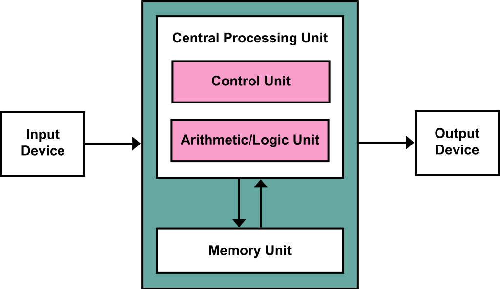

컴퓨터의 역사와 함께 현대적인 컴퓨터의 구조가 어떻게 변화되어 왔는지 가볍게 살펴보기 좋습니다.  
영상: ['컴퓨터'의 구조는 어떻게 되어있을까? CPU와 메모리! [안될과학 - 랩미팅 15화]](https://youtu.be/SiC74U8aJbM)

### 컴퓨터의 구조는 어떻게 되어있을까?

- 컴퓨터의 역사
  - 1946년 ENIAC 미국에서 제작된 최초의 컴퓨터
    - 애니악은 연산처리는 가능했지만, 소프트웨어는 가지고 있지 않았음.
  - 폰 노이만이 소프트웨어와 하드웨어, 연산하는 CPU 로 구성된 컴퓨터 체계를 잡음
  - 
  - CPU 계산에 사용되는 논리회로
    - AND
    - OR
    - XOR
    - NAND
    - NOR
    - XNOR
  - 위 논리 회로를 이용하여 전기적 스위칭을 구현
  - Jack Kilby가 집적회로의 원리를 만들어냄.
  - 이를 이용하여 Intel에서 1971년 최초의 CPU 등장
  - CPU는 연산처리만 수행. 데이터를 저장하는 RAM의 등장
  - 하지만 속도가 느림. 그래서 CPU 안에 속도가 빠른 캐시메모리가 들어가있다.
  - RAM은 용량이 작아서 보조기억장치인 HDD, SSD가 필요. 반영구적인 저장장치
  - CPU의 역할은
    - 1. 데이터 Fetch
    - 2. 계산
    - 3. 처리된 데이터를 메모리에 store
    - 이 한 싸이클을 Clock이라고 부른다.
  - 이 과정을 CPU 내에 병렬처리를 하기 위해 코어의 수를 늘림 --> 듀얼코어
  - 한계점도 있다.
    - 병렬처리가 늘어나면 빨라질수 있다.
    - 하지만 늘어날 수록 전기 소모량과 발열 증가
    - 이에 따른 쿨링 --> 결국 전기 소모량 증가
    - 병렬연산 할 경우 검증의 과정이 필요
    - 병렬연산이 많아질수록 검산의 시간이 길어지고, 속도 향상에 한계에 부딪히기도 한다.
    - 그래서 양자컴퓨터가 등장

컴퓨터-구조부터 운영체제까지 과목의 전체적인 구조를 살펴보기 좋습니다.  
영상: [컴퓨터구조 운영체제 클라우드 안쉬고 처음부터 끝까지 30분동안 설명하기. 컴퓨터-구조 처음 공부하실 때 참고하세요.](https://youtu.be/uMyKBYF48nY)

### 컴퓨터-구조 / 운영체제

- 컴퓨터의 하드웨어는 물리적인 구조에서 어떻게 동작되는가에 초점
- 운영체제는 윈도우, 리눅스, 맥, 유닉스 가 대표적
- 